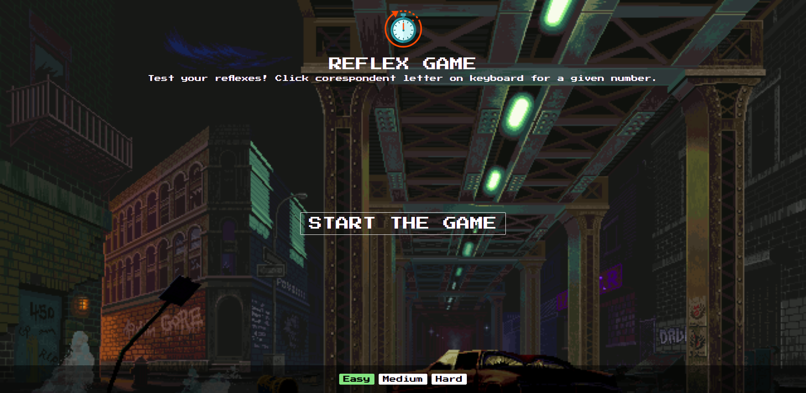

# REFLEX GAME

Small reflex game, done in 6 hours as a short chalange.
So it can be optimized, fix for responsive screens, better written for sure 😉

## Install
- Clone this project with git clone `https://github.com/drejcreative/mern-boilerplate-2020.git`
- Instal dependencies with commant `yarn install`
- Start dev server with commant `yarn start`
- Build comand is `yarn buil`

### Notes
[Create React App](https://github.com/facebook/create-react-app) is used for a starting point of this project.